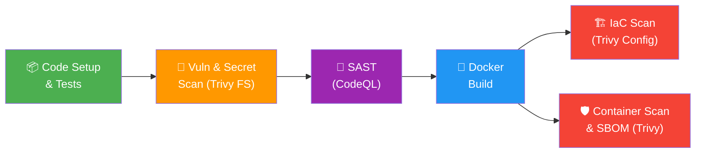

# 🛡️ Secure CI/CD Pipeline with Automated Vulnerability Scanning

A production-grade DevSecOps reference project demonstrating how to integrate automated security scanning into every stage of a CI/CD pipeline using GitHub Actions.

## 🏗️ Architecture



## 📋 Pipeline Stages

| Stage | Tool | Purpose |
|-------|------|---------|
| **Code Setup** | Node.js, npm | Install dependencies, lint, and run unit tests |
| **Vuln & Secret Scan** | Trivy FS | Detect vulnerable dependencies (lodash CVEs) and hardcoded secrets |
| **SAST** | CodeQL | Static analysis for JavaScript security vulnerabilities |
| **Docker Build** | BuildKit | Multi-stage build with non-root user |
| **IaC Scan** | Trivy Config | Scan Terraform for misconfigurations |
| **Container Scan** | Trivy Image | Scan container image for CVEs; generate CycloneDX SBOM |

## 🚀 Quick Start

### Prerequisites
- Node.js >= 20
- Docker
- Terraform >= 1.5 (for infrastructure)

### Local Development

```bash
# Install dependencies
npm ci

# Run in development mode (with --watch)
npm run dev

# Run tests
npm test

# Run linter
npm run lint
```

### Docker

```bash
# Build
docker build -t secure-cicd-app:latest .

# Run
docker run -p 3000:3000 secure-cicd-app:latest

# Health check
curl http://localhost:3000/health
```

## 🔍 API Endpoints

| Method | Path | Description |
|--------|------|-------------|
| `GET` | `/health` | Health check — returns status, uptime, timestamp |
| `GET` | `/api/v1/info` | App info — returns name, version, environment |

## ⚠️ Intentional Vulnerabilities (For Demonstration)

This project **intentionally** includes security issues for the scanners to detect:

1. **Vulnerable Dependency**: `lodash@4.17.19` — contains known prototype pollution vulnerabilities (CVE-2020-28500, CVE-2021-23337)
2. **Hardcoded Secrets**: Fake AWS and GitHub credentials in `src/index.js` comments

> **🚨 Do NOT use these patterns in real projects.** They exist solely to validate that the pipeline's security scanning stages work correctly.

## 📁 Project Structure

```
secure-cicd-pipeline/
├── .github/workflows/
│   └── devsecops-pipeline.yml    # 6-stage DevSecOps pipeline
├── infra/
│   ├── main.tf                   # AWS ECS Fargate deployment
│   ├── variables.tf              # Terraform variables
│   └── outputs.tf                # Terraform outputs
├── src/
│   ├── index.js                  # Express application entry point
│   └── routes/
│       ├── health.js             # Health check endpoint
│       └── info.js               # App info endpoint
├── tests/
│   └── health.test.js            # API tests
├── .dockerignore
├── .eslintrc.json
├── .gitignore
├── Dockerfile                    # Multi-stage, non-root build
├── package.json
└── README.md
```

## 🔐 Security Features

- **Helmet.js** — Sets secure HTTP headers
- **CORS** — Configurable cross-origin resource sharing
- **Rate Limiting** — 100 requests per 15-minute window
- **Non-root Docker user** — Container runs as `appuser`
- **Multi-stage build** — Minimal attack surface in production image
- **Health checks** — Docker and ECS health monitoring
- **SARIF uploads** — All scan results visible in GitHub Security tab
- **SBOM generation** — CycloneDX Software Bill of Materials

## 📜 License

MIT
